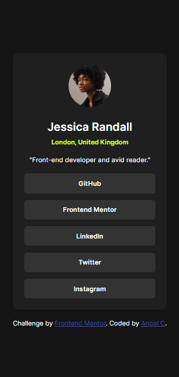

# Frontend Mentor - Social links profile solution

This is a solution to the [Social links profile challenge on Frontend Mentor](https://www.frontendmentor.io/challenges/social-links-profile-UG32l9m6dQ). Frontend Mentor challenges help you improve your coding skills by building realistic projects.

## Table of contents

- [Overview](#overview)
  - [Screenshot](#screenshot)
  - [Links](#links)
- [My process](#my-process)
  - [Built with](#built-with)
  - [What I learned](#what-i-learned)
  - [Continued development](#continued-development)
- [Author](#author)

## Overview

### Screenshot

### Links

- Live Site URL: [Add live site URL here](https://angelcoronait.github.io/FM-SocialLinkProfile/)

## My process

### Built with

- Semantic HTML5 markup
- CSS custom properties
- Flexbox

### What I learned

I try following other solutions i saw and star adding better naming for classes.

### Continued development

I would like to get better with getting fonts to look like in the challenges, it always take me a long time.

## Author

- Frontend Mentor - [@AngelCoronaIT](https://www.frontendmentor.io/profile/AngelCoronaIT)
